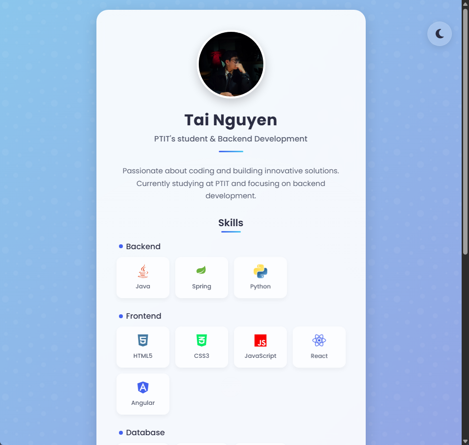

# 👨‍💻 Tai Nguyen - Personal Website

<div align="center">


A modern, responsive personal website showcasing my skills and professional information.

[View Live Website](https://web-pro5.vercel.app) • [Report Bug](mailto:ductai01102003@gmail.com) • [Request Feature](mailto:ductai01102003@gmail.com)

[](https://web-pro5.vercel.app)

</div>

## ✨ Overview

This is a clean, interactive personal website built with HTML, CSS, and JavaScript. It features a responsive design, dark mode toggle, smooth animations, and a skills showcase section with custom SVG icons.

## 🚀 Features

<table>
  <tr>
    <td>
      <h3>🌓 Dark/Light Mode</h3>
      <p>Toggle between dark and light themes with user preference memory</p>
    </td>
    <td>
      <h3>📱 Responsive Design</h3>
      <p>Looks great on all devices from mobile to desktop</p>
    </td>
  </tr>
  <tr>
    <td>
      <h3>🎨 Custom SVG Icons</h3>
      <p>Professional skill icons with hover effects</p>
    </td>
    <td>
      <h3>✨ Smooth Animations</h3>
      <p>AOS integration for smooth page animations</p>
    </td>
  </tr>
  <tr>
    <td>
      <h3>⚡ Performance Optimized</h3>
      <p>Fast loading with optimized assets and code</p>
    </td>
    <td>
      <h3>🔜 Coming Soon Modals</h3>
      <p>Professional placeholders for sections under development</p>
    </td>
  </tr>
</table>

## 🛠️ Technologies Used

<div align="center">


</div>

## 📁 Project Structure

```
📦 web-pro5
 ┣ 📜 index.html              # Main HTML file
 ┣ 📜 styles.css              # CSS styles
 ┣ 📜 script.js               # JavaScript functionality
 ┣ 📂 assets                  # Assets directory
 ┃ ┣ 🖼️ taind.webp           # Profile image
 ┃ ┣ 🖼️ preview_web.png      # Website preview image
 ┃ ┣ 🖼️ mongodb-icon.svg     # MongoDB icon
 ┃ ┣ 🖼️ spring-icon.svg      # Spring icon
 ┃ ┣ 🖼️ python-icon.svg      # Python icon
 ┃ ┣ 🖼️ mysql.svg            # MySQL icon
 ┃ ┣ 🖼️ oracle.svg           # Oracle icon
 ┃ ┣ 🖼️ git-icon.svg         # Git icon
 ┃ ┣ 🖼️ aws-icon.svg         # AWS icon
 ┃ ┗ 🖼️ google-cloud-icon.svg # Google Cloud icon
 ┗ 📜 README.md               # This file
```

## 🚀 Setup and Usage

1. Clone or download this repository
   ```bash
   git clone https://github.com/tain03/web-pro5.git
   ```
2. Open `index.html` in your web browser
3. No build process or server required - it's a static website!

### 🌐 Deployment

This website is deployed on Vercel at [web-pro5.vercel.app](https://web-pro5.vercel.app)

## 🎨 Customization

<table>
  <tr>
    <th>Component</th>
    <th>How to Customize</th>
  </tr>
  <tr>
    <td>🎨 Colors</td>
    <td>Edit the CSS variables in the <code>:root</code> section of <code>styles.css</code></td>
  </tr>
  <tr>
    <td>📝 Content</td>
    <td>Update personal information in <code>index.html</code></td>
  </tr>
  <tr>
    <td>🛠️ Skills</td>
    <td>Add or remove skills by modifying the skill items in <code>index.html</code></td>
  </tr>
  <tr>
    <td>🖼️ Icons</td>
    <td>Add new SVG icons to the <code>assets</code> folder and reference them in the HTML</td>
  </tr>
</table>

## 🌐 Browser Support

<div align="center">


</div>

## 🔮 Future Enhancements

<div align="center">

| Feature | Description | Status |
|---------|-------------|--------|
| 📂 Portfolio | Project showcases with details and links | 🔜 Coming Soon |
| 📧 Contact Form | Interactive contact form with validation | 🔜 Coming Soon |
| 📝 Blog | Personal blog section | 📅 Planned |
| 🎮 Interactive Elements | More interactive UI components | 📅 Planned |
| ⚡ Performance | Further performance optimizations | 🔄 Ongoing |

</div>

## 📜 License

This project is available for personal use and learning purposes.

## 📬 Contact

<div align="center">

[](mailto:ductai01102003@gmail.com)

</div>

---

<div align="center">
  <sub>Built with ❤️ by Tai Nguyen</sub>
</div>
